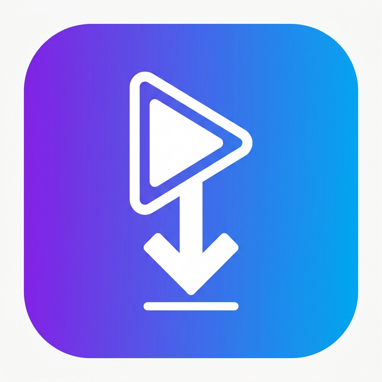

<p align="center">
  
</p>

<h1 align="center">MediaStreamer</h1>

<p align="center">
  <strong>An all-in-one media player, downloader &amp; LAN streamer for Android</strong>
</p>

<p align="center">
  Built with Flutter &amp; Dart · Open-source · Non-commercial
</p>

---

## ✨ Features

### 🎬 Video Player
- Play **local videos &amp; audio** from device storage.
- **Gesture controls** — swipe vertically for brightness/volume, horizontally to seek.
- **Double-tap to skip** forward/backward (10 s).
- **Playback speed** picker (0.25×–3.0×).
- Controls **auto-hide** with configurable timer.
- **Screen lock** to prevent accidental taps during playback.
- Fullscreen landscape playback.

### ⬇️ YouTube Downloader
- Paste or share any YouTube link to start downloading.
- **Format &amp; quality picker** — choose between muxed, video-only, and audio-only streams with file-size previews.
- **Real-time progress bar** with download speed and ETA.
- Saves to the public `Downloads/MediaStreamer` folder visible to other apps.
- **Background download notifications** so you can leave the app while downloading.
- **Robust Download Manager**: Pause, resume, cancel, and prevent duplicates mid-flight.
- Auto-scans Android MediaStore after download.

### 🌐 Ad-Blocking Web Browser
- Built-in private web browser accessible from the "More" tab.
- Automatically blocks known ad networks, trackers, and popup windows.
- **Smart Link Detection** — detects when you navigate to a YouTube video and routes it instantly to the downloader.

### 📡 LAN Streaming
- **Stream any local video** to other devices on the same Wi-Fi network.
- Built-in HTTP server with a beautiful embedded HTML5 player.
- Full **range-request** support for seamless seeking.
- Supports MP4, WebM, MKV, AVI, MOV, FLV, M4V, TS, 3GP, and common audio formats.
- Share the stream URL or use the **Receiver** tab to discover streams automatically via **Bonsoir/mDNS**.

### 📂 Local Media Browser
- Browse **all folders** on your device with breadcrumb navigation.
- **Search** files by name in real time.
- **Sort** by name, date, or size (ascending/descending).
- **Filter** by media type — video, audio, or all files.
- Tap-to-play any supported file.
- Appears in Android's **"Open With"** menu for all media file types.

### 📋 Playlists
- Create, rename, and delete custom playlists.
- Add local files or YouTube links to any playlist.
- One-tap playback of the entire playlist.

### 📝 Video Notes
- Prompted to write notes **after watching** (post-watch dialog).
- Notes are tied to the video and include rating &amp; key highlights.
- **Export notes** as JSON for backup or sharing.

### 🔄 Resume Playback
- Automatically **saves your position** when you stop watching.
- Prompted to **resume from where you left off** when re-opening a video.
- Configurable in the **Settings** tab.

### 🔗 Share Intent Integration
- Share a YouTube link **from any app** directly into MediaStreamer.
- **Seamless Share Overlay**: When sharing from YouTube, MediaStreamer opens a transparent popup rather than forcing you to leave YouTube! Just pick a video quality and it will close automatically while downloading in the background.

### 🎨 Modern UI
- Sleek **dark theme** with gradient accents.
- Smooth animations and transitions.
- Bottom navigation with Home, Library, Downloads, Playlists, and More tabs.

---

## 🏗️ Architecture

| Layer | Contents |
|-------|----------|
| **Screens** | `HomeScreen`, `PlayerScreen`, `LibraryScreen`, `FolderBrowserScreen`, `DownloadsScreen`, `PlaylistsScreen`, `PlaylistDetailScreen`, `LinksScreen`, `StreamScreen`, `ReceiverScreen`, `NotesScreen`, `MoreScreen` |
| **Services** | `YoutubeService`, `StreamingServer`, `LocalMediaService`, `DatabaseService`, `NetworkDiscoveryService`, `DownloadNotificationService` |
| **Models** | `DownloadTask`, `FolderItem`, `Playlist`, `PlaylistItem`, `StreamInfoItem`, `VideoNote`, `YoutubeLink` |
| **Widgets** | `VideoTile`, `FormatPickerSheet`, `DownloadProgressTile`, `AddToPlaylistSheet`, `LinkFormDialog`, `NoteCard`, `PostWatchDialog` |

---

## 🚀 Getting Started

### Prerequisites
- Flutter SDK `^3.11.0`
- Android SDK with API 21+

### Build &amp; Run

```bash
# Clone the repository
git clone https://github.com/your-org/media-streamer.git
cd media-streamer

# Install dependencies
flutter pub get

# Run in debug mode
flutter run

# Build a release APK
flutter build apk --release
```

The release APK will be located at `build/app/outputs/flutter-apk/app-release.apk`.

---

## 📦 Key Dependencies

| Package | Purpose |
|---------|---------|
| `video_player` | Local &amp; network video playback |
| `youtube_explode_dart` | YouTube metadata &amp; stream extraction |
| `shelf` / `shelf_static` | HTTP server for LAN streaming |
| `bonsoir` | mDNS/Bonjour device discovery |
| `network_info_plus` | Wi-Fi IP detection |
| `sqflite` | Local SQLite database for playlists, notes &amp; links |
| `provider` | State management |
| `permission_handler` | Runtime permission requests |
| `share_plus` | Share content to other apps |
| `receive_sharing_intent` | Receive shared URLs from other apps |
| `flutter_local_notifications` | Download progress notifications |
| `path_provider` | Platform-aware directory access |
| `intl` | Date &amp; number formatting |

---

## 📋 Plan

Here is the prioritized list of enhancements to apply:
- [ ] View original thumbnails on the file
- [ ] When screen is locked, continue playing, expose controls on lock screen
- [ ] Auto rotate by default, regardless of phone settings
- [ ] True background download
- [ ] Continuous touch: playback speed 2x
- [ ] In download pop-up: remove non-practical formats, make sure they actually work
- [ ] Download history, options to pause, resume, redownload, copy link
- [ ] Download duplicate detection and handling
- [ ] Fix: sound doesn't work with Bluetooth devices

---

## 📄 License

This project is licensed under the **MediaStreamer Non-Commercial License**.

- ✅ Free for **personal, educational, and non-commercial** use.
- ❌ **Commercial use is prohibited** without written permission.
- ✅ Only **Tau Automation** is authorized to use this software commercially.

See [LICENSE](LICENSE) for full details.

---

## ☕ Support the Project

If you find MediaStreamer useful and would like to support its continued development, consider buying me a coffee! 

<a href="https://buymeacoffee.com/ahmedtariqh" target="_blank"></a>

---

<p align="center">
  Made with ❤️ by <strong>Tau Automation</strong>
</p>
